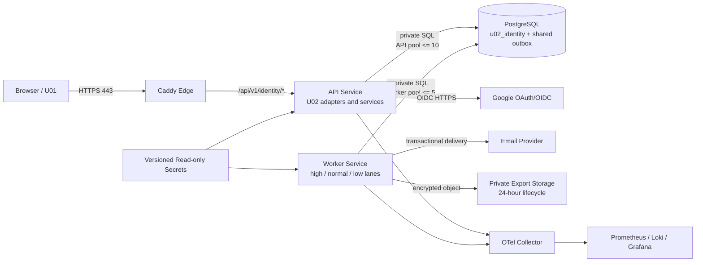
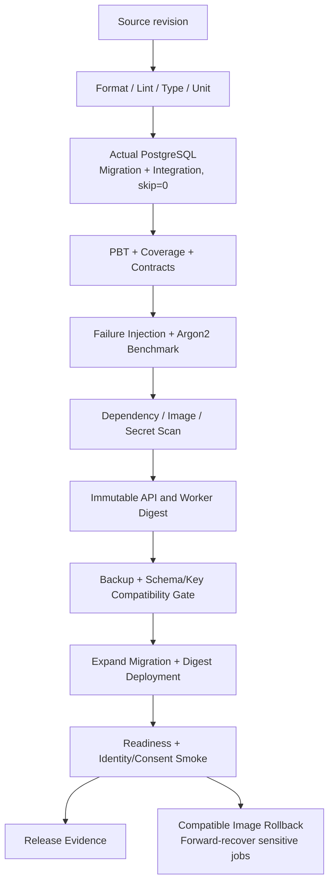

# U02 Deployment Architecture

## Architecture Overview

Remote Prototype는 U07의 단일 cloud-neutral Linux host와 Docker Compose project를 공유한다. Local과 CI는 동일한 schema, migration, role 및 contract를 실제 PostgreSQL에 적용할 수 있으면 Docker 없이도 완전한 품질 검증 경로가 된다.

## Remote Prototype Topology

Text alternative: Browser traffic reaches only Caddy, which forwards U02 routes to the API. API and worker use separate PostgreSQL pools on private networks. The API reaches Google OAuth; the worker reaches the email provider and private export storage. Both emit privacy-safe telemetry and receive only explicitly granted versioned secrets.

## Network and Trust Boundaries

| Boundary | Allowed Flow | Denied by Default |
|---|---|---|
| Internet to host | TCP 80/443 to Caddy | API, PostgreSQL, worker and observability direct ports |
| Caddy to API | versioned public identity routes and OAuth callback | database and secret access |
| API to PostgreSQL | `u02_api_runtime` private connection | DDL, backup and unrelated-unit write |
| Worker to PostgreSQL | `u02_worker_runtime` and registered job types | public ingress and migration ownership |
| API egress | Google OIDC and required DNS/TLS | arbitrary provider destinations |
| Worker egress | transactional email and private export storage | public object ACL and arbitrary destinations |
| Telemetry | allow-listed redacted events to collector | PII, token, UserId, object reference |
| Operator | Caddy-authenticated Grafana/deep health | direct public database access |

## Environment Configuration Matrix

| Concern | Local | CI Test | Remote Prototype |
|---|---|---|---|
| Runtime | direct process or Compose | job process or image | Docker Compose services |
| PostgreSQL | native/container; actual service required | ephemeral actual service | private container/volume |
| Current verified path | PostgreSQL 17.10 on 127.0.0.1:55432 | recreated by pipeline | not implied by Local service |
| Email | mail sink | fake adapter | transactional provider |
| OAuth | registered local test callback/stub | contract stub and failure injection | exact HTTPS callback |
| Export | fake/minimal private emulator | fake adapter | isolated S3-compatible storage |
| Secrets | git-ignored local files | ephemeral test secrets | permission-restricted Compose secret files |
| Observability | console/optional profile | test artifacts | always-on shared stack |

Connection values and secret contents are never committed. CI fails rather than skips when a marker-selected PostgreSQL integration test lacks a reachable database.

## Container and Service Mapping

| Service | Networks | Secret Grants | Persistent State | Health |
|---|---|---|---|---|
| `caddy` | public, observability | none from U02 | shared `caddy_data` | config and upstream readiness |
| `api` | public, private, observability | API DB, OAuth, KEK, blind key, session pepper | none | public readiness, protected deep detail |
| `worker` | private, observability | worker DB, email, export, KEK, blind key | none | lane claim and backlog health |
| `postgres` | private | database server credentials | shared `postgres_data` | internal readiness |
| `otel-collector` | observability | telemetry endpoint only | bounded buffer | collector readiness |
| `prometheus/loki/grafana` | observability | monitoring/contact secrets | separated limited volumes | protected operator view |
| `backup-runner` | private | backup DB/object credentials; no U02 decrypt key | transient staging only | job status/checksum |

## Database Deployment

1. pre-deploy backup과 free-space/connection headroom을 확인한다.
2. `u02_migration_owner`로 expand-only Alembic migration을 실행한다.
3. schema, indexes, grants와 old/new image compatibility를 검증한다.
4. `u02_api_runtime`과 `u02_worker_runtime`에는 필요한 DML만 부여한다.
5. migration owner credential을 runtime에서 제거한다.
6. 실제 PostgreSQL integration test와 smoke query를 실행한다.

Contract migration은 이전 image 사용 기간이 끝난 뒤 별도 release에서 수행한다. deletion progress, consent history와 key-version reference를 제거하는 downgrade는 허용하지 않는다.

## Secret and Key Deployment

| Secret Class | API | Worker | Backup | Rotation Rule |
|---|---:|---:|---:|---|
| current/previous KEK handles | read | read | no | dual-read/new-write, drain 후 retirement |
| blind-index key versions | read | read | no | dual-index migration |
| session HMAC pepper versions | read | only if session job requires | no | new session on current; previous lookup during bounded window |
| Google OAuth credential | read | no | no | provider registration과 함께 rotate |
| email credential | no | read | no | independent provider rotation |
| export storage credential | no | read | no | bucket/prefix-scoped rotation |
| backup storage credential | no | no | read/write | export object 접근 금지 |

배포 전 manifest는 required key version의 존재와 file permission만 확인하며 값은 출력하지 않는다. old key retirement는 old-version row count 0, restore sample과 rollback window 종료 후 별도 승인한다.

## Job Deployment and Scheduling

- 한 worker image가 registered handler를 제공하고 runtime config로 high·normal·low lane budget을 설정한다.
- claim query는 lane/status/available time partial index를 사용하고 lease owner와 expiry를 저장한다.
- shutdown 시 새 claim을 중단하고 진행 batch를 commit 또는 rollback한 뒤 lease를 반환한다.
- re-encryption은 500-row checkpoint, export는 단일 request artifact, deletion은 category step 단위로 commit한다.
- high lane은 normal/low backlog와 무관하게 최소 connection/concurrency slot을 확보한다.

## Deployment Pipeline

Text alternative: A source revision passes static checks, real PostgreSQL migration and non-skipped integration tests, PBT, failure/Argon2 tests and scans before image publication. Deployment requires backup and compatibility checks, then applies expand migration and immutable digests. Failed verification rolls back only the compatible image while deletion, consent and key-rotation state recover forward.

## Verification Gates

| Gate | Pass Condition | Blocking Failure |
|---|---|---|
| PostgreSQL | migration succeeds; `pytest -m integration` passes with zero skips | missing/unreachable database or skipped selected test |
| Connection budget | API <=10, worker <=5 total and global headroom retained | replica multiplication exceeds limit |
| Argon2 | memory >=64 MiB, single hash p95 <=300ms, executor saturation bounded | security parameter reduction without review |
| Session/CSRF | Secure/HttpOnly/Lax, signed token, origin and rotation tests | token leakage or state-changing bypass |
| Encryption | round-trip, tamper failure, separated keys, restartable rotation | plaintext fallback or missing required key |
| Data rights | export 24h/one-time; deletion 72h and disabled invariant | artifact backup/public exposure or account reactivation |
| Feature | monotonic version, no duplicate contribution, backlog alert | stale consent snapshot |
| Recovery | U02 restore invariants pass | revoked session/current consent/deletion corruption |
| Observability | required dashboard/alerts and privacy label tests pass | PII/token in telemetry |

## Rollback and Forward Recovery

- application fault는 이전 compatible API/worker digest로 rollback한다.
- expand migration은 유지하고 이전 image가 읽을 수 없는 contract change는 배포 전 차단한다.
- credential/session policy 변경은 이전 policy read support를 bounded window 동안 유지한다.
- deletion, consent withdrawal, export expiration과 key rotation은 database snapshot rollback으로 되돌리지 않는다.
- worker job은 idempotent checkpoint에서 forward recovery한다.
- ciphertext/key mismatch는 restricted incident로 처리하고 plaintext 또는 legacy unverified value로 fallback하지 않는다.

## Failure and Recovery Exercises

- 월별: Google timeout/circuit, PostgreSQL consent read failure, session write failure, feature backlog, deletion retry exhaustion과 rotation restart 중 선택된 dependency exercise를 자동 또는 rehearsed test로 수행한다.
- 분기별: U07 isolated restore에 U02 schema와 별도 key manifest를 주입해 session/consent/deletion/feature invariant를 검사한다.
- 배포별: PostgreSQL integration skip=0, migration compatibility, required secret manifest와 privacy telemetry test를 실행한다.

## Shared Infrastructure Impact

공유 host, Caddy, PostgreSQL, outbox, observability, CI와 backup runner는 새 resource 종류 없이 재사용한다. 다음 shared contract가 추가된다.

- `u02_identity` schema와 U02-specific migration/API/worker roles
- identity route와 exact OAuth callback route
- U02 secret grants와 export-storage credential isolation
- high/normal/low outbox lane index와 claim budget
- U02 dashboard, alert와 privacy-safe label allow-list
- Docker-independent actual PostgreSQL quality-gate rule

이 변경은 `aidlc-docs/construction/shared-infrastructure.md`에 반영한다.

## Extension Compliance

- **Resiliency**: isolated processes/pools/lanes, health, alerts, backup/restore, immutable deployment, compatible rollback과 failure exercise를 실제 resource에 매핑했다.
- **Property-Based Testing**: actual PostgreSQL Local/CI gate와 seed·shrink·counterexample artifact를 delivery pipeline에 포함했다.
- **Security Baseline**: extension은 disabled이므로 N/A다. TLS, private network, key separation, secret grant와 least privilege는 core U02 requirement로 적용했다.

적용 가능한 활성 extension의 blocking finding은 없다.

