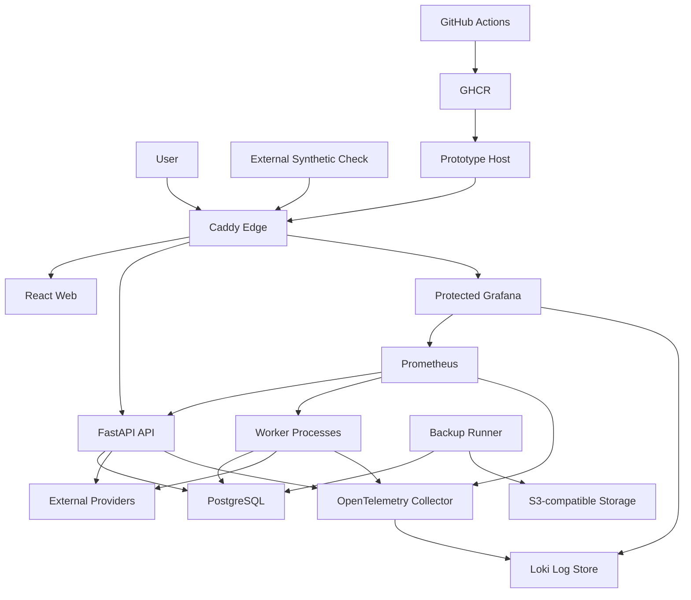

# U07 Deployment Architecture

> **Status: Ready for Review** — 공식 Caddy, Public Domain 자동 HTTPS와 Application Rate Limit 결정을 반영했다.

## Container Topology

### Text Alternative

1. 사용자는 Caddy를 통해 React Web, FastAPI API와 보호된 Grafana에 접근한다.
2. API와 Worker만 PostgreSQL에 접근하고 외부 Provider 호출은 제한된 Outbound 경로를 사용한다.
3. API와 Worker Telemetry는 OpenTelemetry Collector로 전달되며 Loki와 Prometheus Data를 Grafana가 조회한다.
4. Backup Runner는 PostgreSQL Export를 암호화해 외부 S3-compatible Storage에 저장한다.
5. 외부 Synthetic Check는 Caddy의 공개 경로를 확인한다.
6. GitHub Actions가 Image를 GHCR에 게시하고 운영자가 Prototype Host에 고정 Digest를 배포한다.

## Compose Service Inventory

| Service | Image Source | Networks | Persistent Storage | Public Port |
|---|---|---|---|---|
| caddy | Pinned upstream image | public_net, observability_net | caddy_data | 80, 443 |
| web | Project GHCR image | public_net | None | None |
| api | Project GHCR image | public_net, private_net, observability_net | None | None |
| worker-ingestion | Project GHCR image | private_net, observability_net | None | None |
| worker-notification | Project GHCR image | private_net, observability_net | None | None |
| postgres | Pinned upstream image | private_net | postgres_data | None |
| otel-collector | Pinned upstream image | observability_net | otel_buffer | None |
| prometheus | Pinned upstream image | observability_net | prometheus_data | None |
| loki | Pinned upstream image | observability_net | loki_data | None |
| grafana | Pinned upstream image | observability_net | grafana_data | None; Caddy protected route |
| backup-runner | Pinned project or tool image | private_net | Temporary only | None |
| restore-verifier | Pinned project or tool image | private_net | Isolated restore volume | None |

`restore-verifier`와 관측성 일부는 Compose Profile로 필요할 때만 실행할 수 있다. Remote Prototype의 핵심 Monitoring은 항상 실행한다.

## Network Access Matrix

| Source | Destination | Purpose | Allowed |
|---|---|---|---|
| Internet | Caddy 80·443 | HTTPS와 Redirect | Yes |
| Internet | Any other Container | 직접 접근 | No |
| Caddy | Web, API | User Traffic Routing | Yes |
| Caddy | Grafana | 보호된 운영 Route | Yes |
| API | PostgreSQL | Online Transaction | Yes |
| Workers | PostgreSQL | Job, Ingestion, Notification | Yes |
| API·Workers | External Providers | HTTPS Adapter Calls | Yes, Egress only |
| API·Workers | OTel Collector | Log·Telemetry | Yes |
| Prometheus | API·Workers·Collector | Metric Scrape | Yes |
| Grafana | Prometheus·Loki | Query | Yes |
| Backup Runner | PostgreSQL·S3 Storage | Export and Upload | Yes |
| Grafana | Email·Webhook | Alert Delivery | Yes, Egress only |

Remote 배포 전 DNS가 Public Domain을 Prototype Host로 해석하고 80·443 Inbound가 외부에서 도달하는지 검사한다. 공식 Caddy Image가 TLS 종료와 Routing을 담당하며, Host는 연결 수준 제한을 적용하고 FastAPI는 신뢰된 Client IP·인증 Identity·Endpoint 기준 HTTP Rate Limit을 집행한다.

## Deployment Flow

### Build and Publish

1. Pull Request에서 Format, Lint, Type, Unit, Contract, Integration과 PBT를 실행한다.
2. 전체 Line 80%와 핵심 Business Rule Branch 100% 목표를 검사한다.
3. Dependency, Secret과 Container Image Scan을 실행한다.
4. Main Release에서 Web, API와 Worker Image를 Build한다.
5. Git Commit·Release Tag·Image Digest와 OpenAPI Artifact를 연결해 GHCR에 게시한다.

### Direct Deploy

1. 운영자가 Release Evidence와 Vulnerability Exception 만료를 검토한다.
2. Pre-deploy Backup을 실행하고 Upload·Checksum을 확인한다.
3. Expand Migration Compatibility를 검증한다.
4. Host의 Image Digest Configuration을 새 Release로 갱신한다.
5. Image를 Pull하고 Compose 서비스를 갱신한다.
6. Liveness, Readiness, Deep Health, Synthetic Feed와 Fallback을 확인한다.
7. Deployment Record에 결과와 Correlation을 남긴다.

### Rollback

1. 새 Version의 Traffic을 중단하거나 Caddy가 Unready API로 Routing하지 않게 한다.
2. 이전 Image Digest와 Configuration을 복구한다.
3. Database가 이전 Application과 호환되는 Expand 상태인지 검사한다.
4. 이전 Container를 기동하고 Readiness를 확인한다.
5. Synthetic Feed와 Recommendation Fallback을 실행한다.
6. 성공 시 Traffic을 복귀하고 실패 시 Backup Restore Runbook으로 전환한다.

## Backup and Restore Flow

### Daily Backup

1. Scheduler가 Backup Runner를 시작한다.
2. Backup 전용 Read Credential로 PostgreSQL Logical Export와 Global Object Export를 생성한다.
3. Manifest, Schema Version, Source Release, Timestamp와 Checksum을 생성한다.
4. Archive를 암호화해 S3-compatible Versioned Bucket으로 Upload한다.
5. Remote Checksum과 Retention Tag를 검증한다.
6. Local Temporary Artifact를 제거하고 Success Metric을 기록한다.

### Quarterly Restore Drill

1. 복원할 Backup과 Matching PostgreSQL Major Image를 고정한다.
2. 격리 Volume과 Restore PostgreSQL Container를 만든다.
3. Archive를 내려받아 Decrypt하고 Checksum을 검증한다.
4. Global Object와 Database를 Restore한다.
5. Schema·Constraint·Row Integrity 검사를 수행한다.
6. API를 Restore Database에 연결해 핵심 Feed와 Recommendation Fallback Smoke Test를 실행한다.
7. RTO·RPO 측정과 결과를 Build-and-Test Evidence에 기록한다.
8. 격리 Resource를 폐기하고 실패 시 Corrective Action을 생성한다.

## Health and Routing

| Endpoint | Exposure | Consumer | Semantics |
|---|---|---|---|
| `/health/live` | Internal through Caddy policy | Docker and Caddy | Process 생존만 확인 |
| `/health/ready` | Internal through Caddy policy | Docker and Caddy | PostgreSQL과 필수 Config 확인 |
| `/health/deep` | Operator authenticated | Operator | 외부 Dependency 상태의 Redacted Summary |
| Public Feed Synthetic | External | Scheduled Monitor | 사용자 관점 Availability |
| Fallback Synthetic | External protected test scenario | Scheduled Monitor | AI 장애 시 규칙 추천 경로 |

## Failure Domains

| Failure Domain | Impact | Isolation and Recovery |
|---|---|---|
| Caddy | 모든 외부 Traffic | Restart, Config Validation, Version Rollback |
| API | User API | Caddy Readiness 제외, Container Restart·Rollback |
| Worker | Ingestion·Notification 지연 | API와 격리, Lease Recovery·Retry |
| PostgreSQL | 모든 Stateful Backend | Readiness 실패, Write Guard, Restore Runbook |
| Observability | 운영 가시성 저하 | Business Request 유지, Local Buffer와 Alert |
| Object Storage | 새 Backup Upload 실패 | 기존 Backup 보존, Retry와 Alert |
| Host | 전체 Prototype 중단 | 새 Host 재구성, Image Pull, Off-host Restore within RTO |

## Monthly and Quarterly Validation

- Monthly: AI Timeout, Content Provider Failure, Circuit Open, Worker Retry·Dead Letter, Alert Routing
- Quarterly: Off-host Backup Download, Isolated Restore, Integrity, Smoke Test, RTO·RPO Measurement
- Migration Release: Expand Compatibility와 이전 Digest Rollback Rehearsal
- Evidence: Timestamp, Commit, Image Digest, Config Version, Seed where applicable, measured result and Corrective Action

## Production Transition

단일 Host, Local Prometheus·Loki와 동일 Host PostgreSQL은 Host 장애를 견디지 못한다. 상용 전환 전 Multi-zone Runtime·Database, 독립 Monitoring, Auto-scaling, Production Backup·PITR와 정식 On-call을 설계해야 한다.

## Extension Compliance

- **Resiliency**: Resource별 Failure Domain, 외부 Synthetic, Off-host Backup, RTO 복구, 직접 Rollback과 Test Cadence를 배포 흐름에 포함했다.
- **PBT**: CI Flow가 Hypothesis, Seed와 Shrunk Artifact를 보존한다. Infrastructure 자체는 PBT 구현 대상이 아니다.
- **Security Baseline**: 비활성화로 N/A. Public Port 최소화, Secret File, 인증된 운영 Route와 Scan Gate는 일반 요구로 적용했다.

현재 Deployment Architecture에서 차단 상태인 Extension Finding은 없다.
