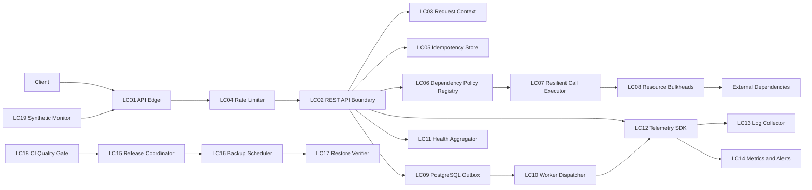

# U07 Logical Components

## Component Topology

### Text Alternative

1. Client Traffic은 LC01 Edge와 LC04 Rate Limiter를 거쳐 LC02 API Boundary로 들어온다.
2. LC02는 LC03 Context, LC05 Idempotency, LC06 Dependency Policy와 LC09 Outbox를 사용한다.
3. LC06은 LC07 Retry·Circuit 실행기와 LC08 Resource Bulkhead를 통해 외부 Dependency를 호출한다.
4. LC09의 Job은 LC10 Worker가 처리한다.
5. API와 Worker Telemetry는 LC12를 통해 LC13 Log와 LC14 Metric·Alert로 전달된다.
6. LC19가 외부 사용자 관점에서 LC01을 점검한다.
7. LC18 CI Gate가 LC15 Release를 승인하고 LC16 Backup과 LC17 Restore 검증이 복구를 지원한다.

## Logical Component Catalog

| ID | Component | Responsibility | State Ownership |
|---|---|---|---|
| LC01 | API Edge | TLS 종료, Routing, Compression, 기본 IP Rate Limit | Edge Configuration |
| LC02 | REST API Boundary | `/api/v1`, Schema Validation, Error Mapping, Domain Dispatch | OpenAPI Contract |
| LC03 | Request Context | Correlation, Deadline, Identity와 Locale Context | Request-scoped only |
| LC04 | Rate Limiter | IP·Identity·Endpoint Cost Bucket 평가 | Rate Counter and Policy |
| LC05 | Idempotency Store | Key·Payload Hash와 Response Replay | IdempotencyRecord |
| LC06 | Dependency Policy Registry | Dependency별 Timeout, Retry, Circuit와 Fallback Policy | Versioned Policy |
| LC07 | Resilient Call Executor | Deadline 적용, Retry·Jitter와 Circuit State 실행 | Circuit State and Attempt Result |
| LC08 | Resource Bulkheads | Dependency별 Connection·Concurrency Limit | Lease and Pool Metric |
| LC09 | PostgreSQL Outbox | Job 상태, Lease, Retry와 Dead Letter 영속화 | OutboxJob |
| LC10 | Worker Dispatcher | Job Type Routing과 Handler 실행 | Worker Lease Context |
| LC11 | Health Aggregator | Liveness, Readiness와 보호된 Deep Health | Health Snapshot |
| LC12 | Telemetry SDK | Log, Metric, Trace Context와 Redaction | Telemetry Context |
| LC13 | Log Collector | 중앙 수집, Buffer와 Retention 전달 | Log Buffer Metadata |
| LC14 | Metrics and Alerts | Metric 저장, Dashboard, Alert Routing | Time Series and Alert State |
| LC15 | Release Coordinator | Artifact Identity, Compatibility Gate, Deploy·Rollback | Release and Deployment Record |
| LC16 | Backup Scheduler | 일일 암호화 Backup, Manifest와 Retention | BackupRecord |
| LC17 | Restore Verifier | Integrity, Smoke Test와 Verified Gate | RestoreAttempt |
| LC18 | CI Quality Gate | Test, Coverage, Contract, PBT, Vulnerability와 Exception | Build Evidence and Exception Record |
| LC19 | Synthetic Monitor | Feed와 Recommendation Fallback 외부 점검 | Synthetic Result |

## Component Contracts

### LC01 API Edge

- **Input**: External HTTPS Request
- **Output**: Internal HTTP Request with trusted forwarding metadata
- **Rules**: Client-supplied forwarding Header를 신뢰하기 전에 덮어쓴다. TLS·Rate Limit·Compression Policy는 Versioned Configuration으로 관리한다.
- **Failure**: 유효한 Error Response 또는 연결 거부; Backend Detail 비노출

### LC02 and LC03 API Context

- **Input**: Validated Edge Request
- **Output**: Typed Command·Query and RequestContext
- **RequestContext**: correlationId, absoluteDeadline, authorizedIdentity, locale, apiVersion
- **Invariant**: 하위 호출 Deadline은 상위 absoluteDeadline을 넘을 수 없다.

### LC04 Rate Limiter

- **Policy Keys**: IP, authenticated identity, endpoint class, cost weight
- **Buckets**: public, authentication, recommendation, administration
- **Invariant**: 관리자·AI 고비용 Traffic이 Public Feed Pool을 고갈시키지 않는다.
- **Configuration**: 구체 Rate와 Burst는 Infrastructure Design과 Load Test에서 확정한다.

### LC05 Idempotency Store

- **Storage**: PostgreSQL Transactional Record
- **Contract**: reserve, complete, markRetryableFailure, replay
- **Invariant**: 동일 Scope·Key·Payload의 완료 요청은 Side Effect를 추가하지 않는다.

### LC06 and LC07 Dependency Control

- **Policy**: dependencyId, timeoutProfile, retryPolicy, circuitPolicy, fallbackPolicy
- **Execution Result**: success, terminalFailure, deadlineExceeded, circuitOpen, degraded
- **Invariant**: Retry-safe가 아닌 호출은 자동 재시도하지 않으며 전체 Deadline을 넘지 않는다.
- **Observability**: Attempt, Backoff, Circuit Transition과 Fallback Result Metric

### LC08 Resource Bulkheads

- **Pools**: apiDatabase, workerDatabase, aiHttp, providerHttp, oauthHttp, notificationHttp
- **Contract**: tryAcquire, release, saturationSnapshot
- **Invariant**: 한 Pool의 포화가 다른 Pool의 Permit을 소비하지 않는다.

### LC09 and LC10 Job Runtime

- **Contract**: enqueue, claimWithLease, complete, retryLater, deadLetter, cancel, requeue
- **Concurrency**: Atomic Claim과 Lease Expiry
- **Scale-out**: Job Type별 Worker Replica가 같은 Store를 안전하게 공유한다.
- **Failure**: Handler 실패가 API Transaction과 격리되고 원인·Attempt를 보존한다.

### LC11 Health Aggregator

- **Liveness**: Process와 Event Loop만 확인한다.
- **Readiness**: PostgreSQL, 필수 Configuration과 요청 처리 능력을 확인한다.
- **Deep Health**: 외부 Dependency 상태를 확인하되 운영자에게만 제한된 결과를 제공한다.
- **Rule**: Optional Provider 장애는 Liveness 실패를 만들지 않는다.

### LC12 to LC14 Telemetry Pipeline

- **Log**: JSON, timestamp, level, service, correlationId or jobId, eventCode, redacted fields
- **Metric**: request duration·count, error, pool, circuit, queue, job, backup, freshness
- **Trace**: 표준 Trace Context 전파; Backend는 선택 사항
- **Alert**: Severity, Owner, Runbook Link와 Incident Reference
- **Failure**: Telemetry Backend 장애는 Business 요청을 차단하지 않고 제한된 Local Buffer를 사용한다.

### LC15 Release Coordinator

- **Input**: Immutable Image, OpenAPI Artifact, Migration Set, Test and Scan Evidence
- **Gate**: Contract, Compatibility, Quality, Vulnerability
- **Actions**: deploy, verify, rollback, record
- **Invariant**: Gate 실패 Release는 Deployable이 아니며 Rollback은 이전 Digest를 사용한다.

### LC16 and LC17 Recovery Components

- **Backup**: schedule, encrypt, createManifest, retain, reportFailure
- **Restore**: restoreIsolated, verifyIntegrity, runSmokeTests, markVerified
- **Invariant**: Integrity와 Smoke Test 둘 중 하나라도 실패하면 Verified가 아니다.
- **Cadence**: 일일 Backup, 월별 Failure Test, 분기별 Restore Drill

### LC18 CI Quality Gate

- **Inputs**: Source Revision, Lock, Tests, Coverage, OpenAPI, Image Scan, Dependency Scan
- **Outputs**: pass, block, time-bound exception
- **Exception**: risk, owner, mitigation, approver, expiresAt; 최대 30일
- **Invariant**: 만료 Exception과 Secret Finding은 통과할 수 없다.

### LC19 Synthetic Monitor

- **Checks**: Public Feed and Rule-based Recommendation Fallback
- **Evidence**: availability, latency, response validation, correlationId
- **Routing**: LC14 Alert Router and lightweight Incident Process

## Dependency Matrix

| Consumer | Providers |
|---|---|
| LC01 | LC04, LC02 |
| LC02 | LC03, LC05, LC06, LC09, LC11, LC12 |
| LC06 | LC07 |
| LC07 | LC08, External Dependencies |
| LC09 | LC10 |
| LC10 | LC06, LC08, LC12 |
| LC12 | LC13, LC14 |
| LC19 | LC01, LC14 |
| LC18 | LC15 |
| LC15 | LC16, LC17 |

## Infrastructure Handoff

| Logical Component | Infrastructure Decision Needed |
|---|---|
| LC01 | Reverse Proxy Product, TLS Certificate와 Rate Limit Storage |
| LC04 | Single-host Counter와 Scale-out Shared Counter 전환 방식 |
| LC05, LC09 | PostgreSQL Schema, Index, Cleanup과 Lease Query |
| LC06~LC08 | Library, Pool Size, Concurrency Limit과 Circuit Threshold |
| LC11 | Docker Healthcheck와 Reverse Proxy Routing 연계 |
| LC13~LC14 | Log Collector, Store, Metrics, Dashboard와 Alert Channel |
| LC15 | Deployment Script, Release Record와 Rollback Command |
| LC16~LC17 | Backup Target, Encryption, Schedule와 Restore Environment |
| LC18 | GitHub Actions Jobs, Scanner와 Artifact Retention |
| LC19 | Synthetic Runner, Schedule와 Network Origin |

## NFR Coverage

| Logical Components | NFR IDs |
|---|---|
| LC01~LC04 | U07-NFR-006~010, 020~025, 044~046 |
| LC05~LC10 | U07-NFR-001~010, 027~034 |
| LC11~LC14, LC19 | U07-NFR-011~012, 027~034 |
| LC15~LC18 | U07-NFR-013~026, 035~043 |
| U01 handoff | U07-NFR-047 |

## Extension Compliance

- **Resiliency**: LC06~LC11과 LC15~LC19가 Dependency Isolation, Health, Monitoring, Recovery, Test와 Incident 요구를 구현 가능한 경계로 만든다.
- **PBT**: LC02, LC05, LC07, LC09, LC15~LC18의 상태·변환 Contract를 Functional Design Property와 Hypothesis Test로 연결한다.
- **Security Baseline**: 비활성화로 N/A. LC01, LC04, LC12, LC15와 LC18이 일반 핵심 보안 요구를 보존한다.

현재 Logical Component 설계에서 차단 상태인 Extension Finding은 없다.
