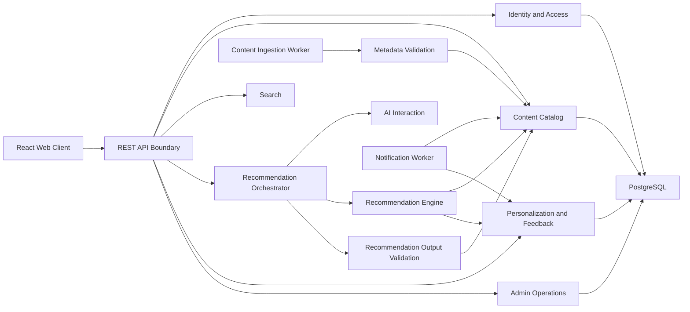
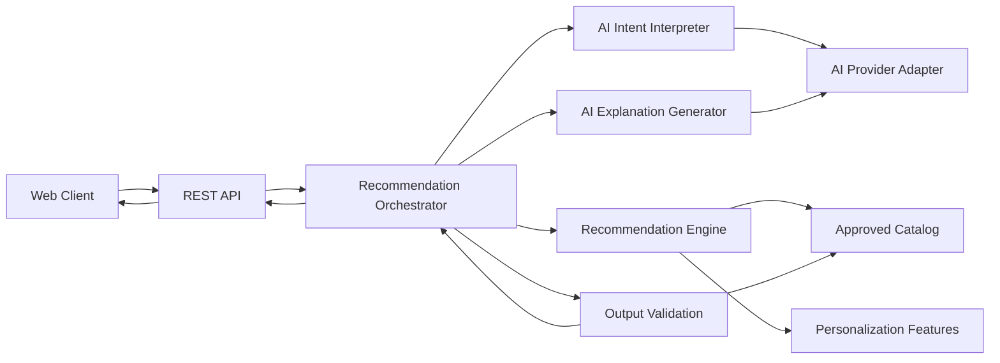
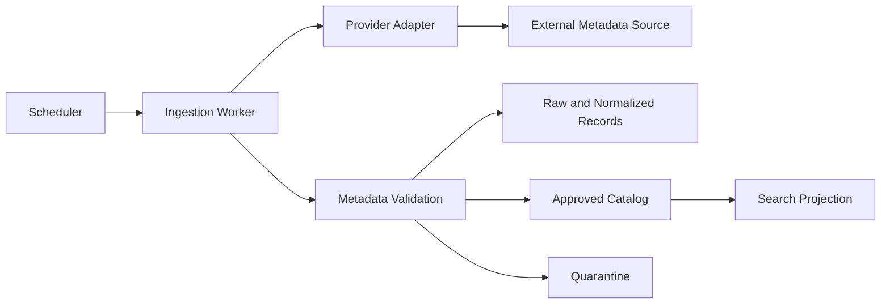

# Component Dependencies and Data Flow

## Dependency Principles

1. Web은 REST API에만 의존한다.
2. API Boundary는 Application Service Port에만 의존한다.
3. Domain Module은 외부 SDK나 Framework에 직접 의존하지 않는다.
4. AI Interaction과 Recommendation Engine은 서로 직접 의존하지 않고 Orchestrator를 통해 조정된다.
5. Recommendation Engine은 승인 Catalog와 Feature Port만 읽는다.
6. Output Validation은 Catalog·Validation Rule을 읽지만 Ranking을 변경하지 않는다.
7. Worker와 API는 PostgreSQL Contract를 공유하되 서로의 Process 내부 구현에 의존하지 않는다.

## Dependency Matrix

`A → B`는 A가 B의 Port를 호출할 수 있음을 뜻한다.

| From | Allowed Dependencies | Forbidden Dependencies |
|---|---|---|
| C01 Web | C02 | DB, AI Provider, Catalog 직접 접근 |
| C02 API | C03, C04, C07, C08, C12, C14 | Provider SDK, Repository 직접 접근 |
| C05 Ingestion | Provider Adapter, C06, Job Port | C01, C08, C10 |
| C06 Metadata Validation | Catalog Write Port, Rule Repository | AI 생성, Ranking |
| C08 Orchestrator | C09, C10, C11, C12, Trace Port | Repository 직접 접근 |
| C09 AI Interaction | AI Provider Port | Catalog 승인, Ranking, 사용자 Identity |
| C10 Recommendation Engine | C04 Read Port, C12 Feature Port | AI Provider, Raw·Quarantine Metadata |
| C11 Output Validation | C04 Read Port, C06 Rule Port | AI Provider, Ranking Mutation |
| C13 Notification | C04, C12, Channel Adapter | Raw·Quarantine Metadata |
| C14 Admin | C03, C04, C06, C11, Observability | 검증 우회, 무권한 Profile 접근 |

## High-Level Component Diagram

### Text Alternative

- React Web은 REST API만 호출한다.
- API는 Identity, Catalog, Search, Recommendation, Personalization, Admin Application Port를 호출한다.
- Recommendation Orchestrator는 AI Interaction, Recommendation Engine, Output Validation을 순서대로 조정한다.
- Ingestion Worker는 Metadata Validation을 거쳐 Catalog에 승인 데이터를 게시한다.
- Identity, Catalog, Personalization, Admin은 Repository Port를 통해 PostgreSQL을 사용한다.

## Recommendation Data Flow

### Recommendation Text Alternative

1. Web Client가 REST 추천 요청을 보낸다.
2. AI Intent Interpreter가 비식별 Context에서 구조화 Intent를 만든다.
3. Recommendation Engine이 승인 Catalog와 Personalization Feature로 최종 순위를 만든다.
4. AI Explanation Generator가 승인 Evidence만으로 문구 초안을 만든다.
5. Output Validation이 후보 적격성과 Grounding을 검증한다.
6. Orchestrator가 안전한 결과 또는 규칙 기반 Fallback을 반환한다.

## Ingestion Data Flow

### Ingestion Text Alternative

1. Scheduler가 Provider Sync Job을 생성한다.
2. Worker가 Adapter를 통해 외부 Metadata를 수집하고 Raw를 보존한다.
3. 정규화 Record를 Metadata Validation이 검사한다.
4. 통과 Record만 Approved Catalog와 Search Projection으로 이동한다.
5. 실패 Record는 원인 Code와 함께 Quarantine으로 이동한다.

## Failure Boundaries

- AI Timeout: 규칙 기반 Ranking과 승인 Metadata Template으로 전환
- Provider Failure: 마지막 정상 Catalog 유지, Job 재시도
- Validation Failure: 해당 Record·문구만 차단하고 전체 Pipeline 오염 방지
- PostgreSQL Failure: API Readiness 실패, 쓰기 중단, 복구 절차 시작
- Notification Failure: 사용자 핵심 피드·추천에는 영향 없이 Delivery Job만 재시도
