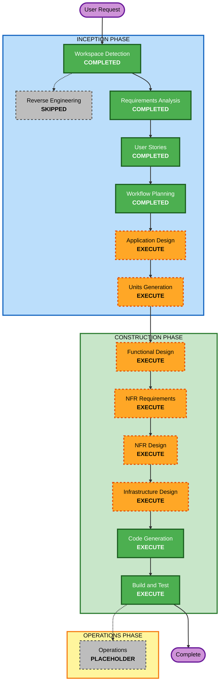

# OTT 통합 피드 및 AI 추천 서비스 Execution Plan

## 1. Detailed Analysis Summary

### Project Context

- **Project Type**: Greenfield
- **Primary Goal**: 여러 글로벌 OTT의 최신 콘텐츠를 통합하고 자연어·개인화·대화형 AI 추천을 제공하는 반응형 웹 프로토타입 구축
- **Target Stack Direction**: React 계열 프론트엔드, Python 백엔드, Docker, GitHub Actions, GHCR
- **Initial Operations Model**: 단일 리전·단일 서버, 직접 배포, 버전 고정 롤백
- **Completed Context**: Requirements 42 FR·14 DR·14 AC, Personas 4개, User Stories 28개

### Change Impact Assessment

| Impact Area | Impact | Summary |
|---|---|---|
| User-facing | High | 통합 피드, 검색, 자연어 추천, 대화형 조정, 계정, 개인화, 알림이 모두 신규이다. |
| Structural | High | Web, API, AI 계층, Recommendation Engine, Metadata Validation Pipeline, 수집·운영 계층이 필요하다. |
| Data model | High | 콘텐츠, 공급자 출처, 승인·격리 상태, 사용자 선호·행동, 추천·검증 추적 모델이 필요하다. |
| API and contracts | High | UI API, 수집 Adapter, AI Adapter, 추천 의도 Schema, 검증 결과 Contract가 필요하다. |
| NFR | High | 개인정보, 핵심 보안, 성능, 최신성, 관측성, 백업·복원, 접근성 요구가 존재한다. |
| Infrastructure | Medium | Docker 기반 단일 서버 프로토타입과 GitHub Actions·GHCR Pipeline이 필요하다. |

### Candidate Component Boundaries

Application Design과 Units Generation에서 최종 확정할 후보 경계이다.

1. Web Experience
2. Backend API and Recommendation Orchestrator
3. Content Ingestion and Catalog
4. Metadata Validation Pipeline
5. Recommendation Engine
6. AI Intent and Explanation Adapter
7. Identity, Profile, Personalization and Feedback
8. Admin and Operations
9. Deployment, Observability and Recovery

### Risk Assessment

- **Risk Level**: High
- **Rollback Complexity**: Moderate
- **Testing Complexity**: Complex
- **Primary Risks**:
  - 콘텐츠 API·라이선스·지역 가용성의 불확실성
  - AI 의도 분석과 설명의 사실 오류
  - Recommendation Engine과 AI 책임 경계 위반
  - 검증되지 않은 Metadata의 사용자 노출
  - 개인정보·행동 데이터 처리
  - 외부 API·AI 서비스 장애
  - 단일 서버 장애와 데이터 복구

## 2. Workflow Visualization

### Text Alternative

1. Workspace Detection — Completed
2. Reverse Engineering — Skipped because the project is Greenfield
3. Requirements Analysis — Completed
4. User Stories — Completed
5. Workflow Planning — Completed
6. Application Design — Execute
7. Units Generation — Execute
8. Functional Design — Execute per applicable unit
9. NFR Requirements — Execute per applicable unit
10. NFR Design — Execute per applicable unit
11. Infrastructure Design — Execute per applicable unit
12. Code Generation — Execute per unit
13. Build and Test — Execute after all units
14. Operations — Placeholder

## 3. Phase Decisions

### INCEPTION PHASE

- [x] **Workspace Detection — COMPLETED**
- [x] **Reverse Engineering — SKIPPED**
  - **Rationale**: 애플리케이션 코드가 없는 Greenfield 프로젝트이다.
- [x] **Requirements Analysis — COMPLETED**
- [x] **User Stories — COMPLETED**
- [x] **Workflow Planning — COMPLETED**
- [x] **Application Design — COMPLETED**
  - **Rationale**: 신규 내부 구성요소, 서비스 책임, API·Adapter·Pipeline 경계와 의존성을 정의해야 한다.
  - **Depth**: Comprehensive
- [x] **Units Generation — COMPLETED**
  - **Rationale**: 여러 도메인, 데이터 모델, API, 추천 알고리즘, 인프라와 독립 검증 단위가 존재한다.
  - **Depth**: Comprehensive

### CONSTRUCTION PHASE

- [ ] **Functional Design — EXECUTE per applicable unit**
  - **Rationale**: 추천 조건·순위·다양성, Metadata 상태 전이, 대화 세션, 개인화·피드백 규칙의 상세 설계가 필요하다.
  - **Depth**: Comprehensive for recommendation, validation and personalization; Standard elsewhere
- [ ] **NFR Requirements — EXECUTE per applicable unit**
  - **Rationale**: 성능, 개인정보, 핵심 보안, 접근성, 최신성, 복원력, 관측성과 PBT Framework 선택이 필요하다.
  - **Depth**: Comprehensive
- [ ] **NFR Design — EXECUTE per applicable unit**
  - **Rationale**: 제한 시간, 재시도, 회로 차단, 캐시, 백업, 저하 운용, 복원력 테스트와 장애 대응 패턴이 필요하다.
  - **Depth**: Comprehensive
- [ ] **Infrastructure Design — EXECUTE**
  - **Rationale**: Docker Compose 단일 서버, 데이터 저장소, GHCR, GitHub Actions, 비밀정보, 백업, 상태 점검과 로그 구성이 필요하다.
  - **Depth**: Standard for prototype, with explicit commercial-transition gates
- [ ] **Code Generation — EXECUTE per unit**
  - **Rationale**: 승인된 설계에 따라 애플리케이션 코드, 테스트와 설정을 구현한다.
  - **Depth**: Comprehensive
- [ ] **Build and Test — EXECUTE**
  - **Rationale**: 단위·통합·사용자 흐름·PBT·저하 운용·복원 검증이 필요하다.
  - **Depth**: Comprehensive

### OPERATIONS PHASE

- [ ] **Operations — PLACEHOLDER**
  - **Rationale**: 현재 AI-DLC 버전에서는 배포·운영 실행 단계가 Placeholder이다. 운영 요구와 실행서는 Construction에 포함한다.

## 4. Recommended Execution Sequence

1. Application Design
2. Units Generation
3. 각 Unit별 Functional Design
4. 각 Unit별 NFR Requirements
5. 각 Unit별 NFR Design
6. 필요한 Unit의 Infrastructure Design
7. 각 Unit별 Code Generation Planning과 승인
8. 각 Unit별 Code Generation
9. 전체 Build and Test

Units Generation에서 의존성과 병렬 가능성을 확정하기 전에는 Unit 이름이나 병렬 순서를 고정하지 않는다.

## 5. Stages to Execute and Skip

- **Remaining stages to execute**: 8
  - Application Design
  - Units Generation
  - Functional Design
  - NFR Requirements
  - NFR Design
  - Infrastructure Design
  - Code Generation
  - Build and Test
- **Skipped stage**: Reverse Engineering
- **Placeholder stage**: Operations

## 6. Planning Estimate

- **Approval checkpoints**: Application Design, Units Generation, each Unit design stage, Code Generation planning·completion, Build and Test
- **Indicative implementation range**: 외부 데이터 접근이 준비된 1인 숙련 개발자 기준 약 6~10주
- **Primary schedule uncertainty**: OTT 데이터 공급 계약·API 제한, AI 공급자 선택과 평가 데이터 준비, 개인정보·접근성 검토

이 추정은 일정 약속이 아니며 Units Generation과 외부 데이터 접근성 확인 후 갱신한다.

## 7. Success Criteria

- 통합 피드와 검색이 승인된 Metadata만 노출한다.
- 한국어·영어 자연어 조건이 동일 Schema로 변환된다.
- Recommendation Engine이 하드 조건과 최종 순위를 통제한다.
- AI 요약·추천 이유가 Metadata 근거 검증을 통과한다.
- 검증 실패와 외부 장애가 안전한 Fallback으로 전환된다.
- 회원이 개인화 데이터와 동의를 통제한다.
- Docker 환경에서 빌드·실행·테스트가 재현된다.
- PBT가 추천·정규화·격리·상태 전이 불변 조건을 검증한다.
- 백업·복원과 버전 롤백 절차가 검증된다.

## 8. Quality Gates

1. **Architecture Gate**: 내부 구성요소 책임과 Contract가 중복·순환 없이 정의됨
2. **Data Gate**: 원본·정규화·승인·격리 상태와 출처·라이선스 추적이 정의됨
3. **Recommendation Gate**: AI가 하드 조건과 최종 순위를 우회하지 못함
4. **Grounding Gate**: 노출 문구의 핵심 주장이 승인 Metadata에 연결됨
5. **Privacy Gate**: 동의, 최소 수집, 내보내기·삭제, AI 입력 비식별화가 검증됨
6. **Resiliency Gate**: 제한 시간, 저하 운용, 백업·복원, 상태 점검과 롤백이 검증됨
7. **Testing Gate**: 예제 기반 테스트와 PBT가 CI에서 재현 가능하게 실행됨

## 9. Extension Compliance

### Security Baseline

- **Status**: Disabled
- **Workflow Decision**: 확장 규칙은 건너뛴다. 핵심 보안·개인정보·접근성은 일반 NFR 및 Quality Gate로 실행한다.

### Resiliency Baseline

| Rules | Status | Workflow Planning Decision |
|---|---|---|
| RESILIENCY-01~02 | Compliant | 중요도·가용성·RTO/RPO를 NFR와 복구 설계에 전달한다. |
| RESILIENCY-03~04 | Compliant | GitHub Actions·GHCR·직접 배포·버전 롤백을 Infrastructure Design과 Build and Test에서 검증한다. |
| RESILIENCY-05~07 | Compliant | 관측성·상태 점검·경보를 NFR와 Infrastructure Design에 포함한다. |
| RESILIENCY-08~09 | N/A | 초기 단일 서버·저규모 예외를 유지하고 상용 전환 Gate를 둔다. |
| RESILIENCY-10~13 | Compliant | 장애 격리, Fallback, 백업·복원·실행서를 설계·테스트한다. |
| RESILIENCY-14 | Compliant | NFR Design에서 사용자에게 복원력 테스트 방식을 확인하도록 계획했다. |
| RESILIENCY-15 | Compliant | 경량 장애 대응과 사후 분석을 NFR Design과 Build and Test에 포함한다. |

### Property-Based Testing

| Rules | Status | Workflow Planning Decision |
|---|---|---|
| PBT-01 | Compliant | Functional Design에서 Unit별 Testable Properties를 식별한다. |
| PBT-02~08 | Compliant | Code Generation Plan과 구현에 왕복·불변·멱등·상태·격리 속성을 포함한다. |
| PBT-09 | Compliant | NFR Requirements에서 Python 및 필요 시 TypeScript PBT Framework를 선택한다. |
| PBT-10 | Compliant | Build and Test에서 예제 기반 테스트와 PBT를 함께 실행한다. |

현재 Workflow Planning 단계에서 차단 상태인 확장 Finding은 없다.

## 10. User Control

이 계획은 권고안이다. 사용자는 승인 전에 EXECUTE·SKIP 결정을 변경하거나 단계 상세도를 조정할 수 있다. 변경 시 의존 관계와 Quality Gate를 다시 평가한다.
